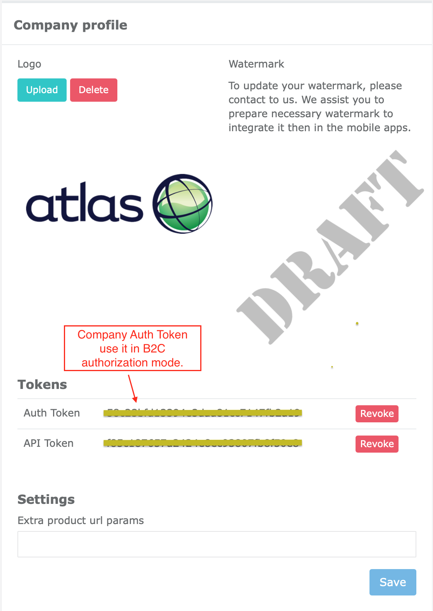
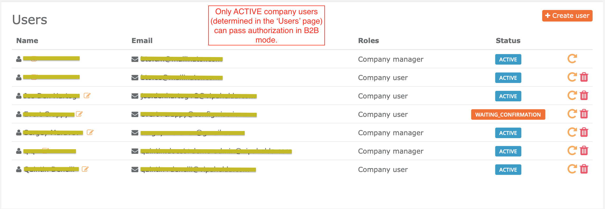

# ConfigWise SDK (Android)

This repository contains Android project (code examples) to explain how to use ConfigWiseSDK.
See more info about ConfigWise service, here: [https://www.configwise.io](https://www.configwise.io)

ConfigWiseSDK (Android) is distributed through bintray: [https://bintray.com/qdoest/configwise/sdk](https://bintray.com/qdoest/configwise/sdk)

The ConfigWiseSDK (Android) is based on [Google ARCore](https://developers.google.com/ar/reference) / [Google SceneForm](https://developers.google.com/sceneform/develop/) stack underhood.
The architectural design of ConfigWiseSDK hides all boilerplate stuff (of ARCore, SceneForm).
It gives simple way of working with AR and 3D experience in your own Android applications.


# License

ConfigWiseSDK framework is distributed under [Apache-2.0](LICENSE) license.


# Prerequisites

ConfigWiseSDK requires the following minimal requirements:

1. Real Android device with installed Android 7.0 (API-24) and above. **NOTICE:** Unfortunately, AR (augmented reality) doesn't work on emulator (on AVDs).
   Make sure, you add the following line in your `app/build.gradle` file:

   ```
   // AR Required apps must declare minSdkVersion >= 24.
   minSdkVersion 24
   ```

2. Your device must be compatible (supported by) Google ARCore. Se the full list of all supported ARCore devices, here: [https://developers.google.com/ar/discover/supported-devices](https://developers.google.com/ar/discover/supported-devices)

3. [Google Play Services for AR](https://play.google.com/store/apps/details?id=com.google.ar.core) must be installed on your device.

4. OpenGL ES 3.0 (or later) must be supported by your device.

5. The following permissions must be added to your `AndroidManifest.xml`:

    ```
    <!-- Always needed for AR. -->
    <uses-permission android:name="android.permission.CAMERA" />
   
    <!-- Indicates that app requires ARCore ("AR Required"). Ensures the app is
         visible only in the Google Play Store on devices that support ARCore.
         For "AR Optional" apps remove this line. -->
    <uses-feature android:name="android.hardware.camera.ar" />
   
    <!-- Used to access ConfigWise backend via network -->
    <uses-permission android:name="android.permission.INTERNET" />
    ```


# Installation

Add ConfigWise SDK dependency to your project:

1. Add ConfigWIse SDK maven repos to your repositories list in the `build.gradle` file:

    ```
    // ConfigWise SDK maven repository
    maven { url 'https://dl.bintray.com/qdoest/configwise' }
    
    // ConfigWise SDK maven repo to download 'real-time updates' related libs
    maven { url "https://jitpack.io" } 
    ```

    For example:

    ```
    allprojects {
        repositories {
            google()
            jcenter()
            mavenCentral()
    
            // ConfigWise SDK maven repository
            maven { url 'https://dl.bintray.com/qdoest/configwise' }
            
            // ConfigWise SDK maven repo to download 'real-time updates' related libs
            maven { url "https://jitpack.io" }
        }
    }
    ```

2. Add ConfigWise SDK lib to `dependencies` section in your `app/build.gradle`:

    ```
    dependencies {
    
        . . .
   
        // ConfigWise SDK
        implementation "io.configwise:sdk:1.2.15"
    } 
    ```


# Quick start

## Example project (general examples how to use ConfigWiseSDK)

Open and run example project distributed here. It is good point to quick start - to get experience with ConfigWiseSDK.

Feel free to use our example project as a skeleton for your own project.

Here you can see demo of current ConfigWise example code:


## Let's initialize ConfigWise SDK in your code

Open your [MyApplication.java](app/src/main/java/io/configwise/android/sdk_example/MyApplication.java)

Set `YOUR_COMPANY_AUTH_TOKEN` in the code, for example:

```
public class MyApplication extends Application {

    @Override
    public void onCreate() {
        super.onCreate();

        initConfigWiseSdk();
    }

    private void initConfigWiseSdk() {
        ConfigWiseSDK.initialize(new ConfigWiseSDK.Builder(this)
                .sdkVariant(ConfigWiseSDK.SdkVariant.B2C)
                .companyAuthToken("YOUR_COMPANY_AUTH_TOKEN")
                .dbAccessPeriod(1 * 60 * 60 * 1000) // (msec) 1 hr. Set 0 if you wish always to request data from server DB (ignoring locally cached queries)
                .lightEstimateEnabled(true)
                .debugLogging(false)
                .debug3d(false)
        );
    }

}
```

There are 2 authorization modes supported by ConfigWiseSDK:

- B2C (`COMPANY_AUTH_TOKEN` is required) - use this method if you NO need ConfigWise users SignIn flow.
Eg: to provide public access to your application or if if you want to use own authorization flow.

    To obtain `COMPANY_AUTH_TOKEN`, go to `CBO (company back office) > Company profile`: [https://manage.configwise.io/configwise/cbo/profile](https://manage.configwise.io/configwise/cbo/profile)

    

- B2B (ConfigWise user credentials are required) - use this method to only permit registered ConfigWise users
of your company to access to your mobile application. This method requires to type `email/password` by your company users
to access backend data. To manage your company users, go to `CBO > Users`: [https://manage.configwise.io/configwise/cbo/employees](https://manage.configwise.io/configwise/cbo/employees)

    

    To use `B2B` mode - set `ConfigWiseSDK.SdkVariant.B2C` in ConfigWise SDK initialization, eg:

    ```
    ConfigWiseSDK.initialize(new ConfigWiseSDK.Builder(this)
            .sdkVariant(ConfigWiseSDK.SdkVariant.B2B)
            .dbAccessPeriod(1 * 60 * 60 * 1000) // (msec) 1 hr. Set 0 if you wish always to request data from server DB (ignoring locally cached queries)
            .lightEstimateEnabled(true)
            .debugLogging(false)
            .debug3d(false)
    );  
    ```

    In `B2B` mode you will additionally need to implement your own `SignIn` form to pass authorization by user.  
    Use `AuthService.getInstance().signIn(email, password);` invocation to do this. To SignOut, use: `AuthService.getInstance().signOut();`

## Subscribe on ConfigWise SDK events (integrate its in your application lifecycle)

TODO: This section will be described soon.

## Setup AR fragment in your app

### Add `io.configwise.sdk.ar.ArFragment` to your `app/src/main/res/layout/activity_ar.xml`

As an example see `activity_ar.xml` in our example code: [app/src/main/res/layout/activity_ar.xml](app/src/main/res/layout/activity_ar.xml)

```
<androidx.fragment.app.FragmentContainerView
        android:id="@+id/arFragmentContainerView"
        android:name="io.configwise.sdk.ar.ArFragment"
        android:tag="arFragment_tag"
        android:layout_width="match_parent"
        android:layout_height="match_parent"
        />
```

See (use) our [ArActivity.java](app/src/main/java/io/configwise/android/sdk_example/controllers/ar/ArActivity.java) as an 
example to create your own implementation.


# Supported 3D file formats

Android ConfigWise SDK supports GLTF and GLB (binary GLTF) formats only. We recommend to use binary version (GLB).

- .glb (.gltf binary)
- .gltf
